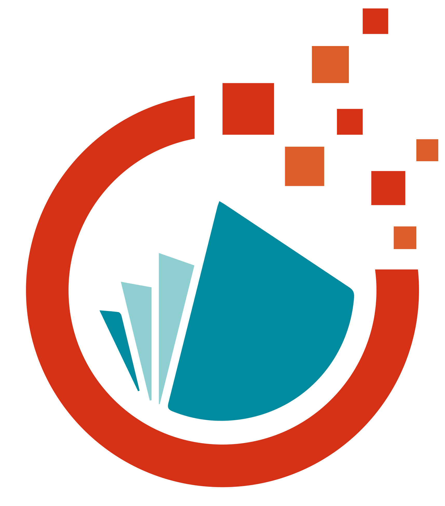
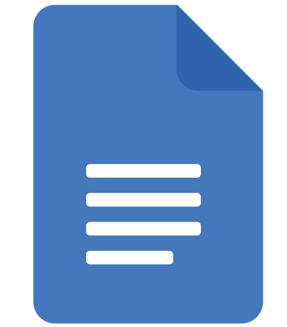
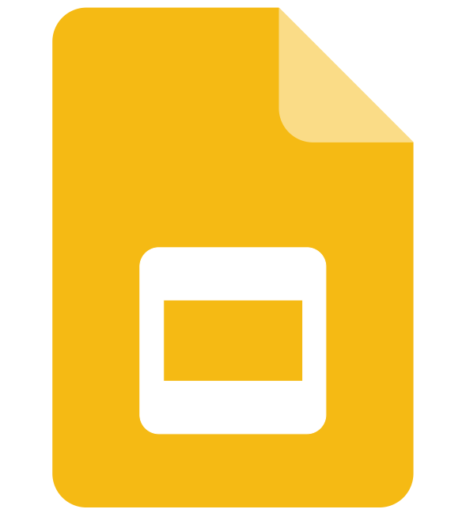
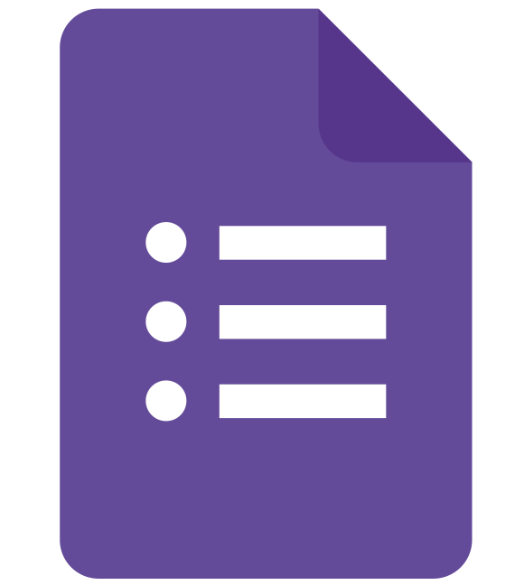

racine
├── lesupport.app
│   ├── main.js            # Processus principal d’Electron
│   ├── index.html         # Interface principale
│   ├── renderer.js        # Gestion de l'interface et des événements
│   ├── package.json       # Configuration du projet
│   ├── update.json
│   ├── version.json
│   ├── style-sheets/           # Dossier des scripts Python
│       ├── style.css
│       ├── light-style.css
│   ├── utils/           # Dossier des scripts Python
│       ├── protocole Hermes/
│           ├── main.js
│           ├── index.html
│           ├── passerelle.js

"main.js"

const { app, BrowserWindow, ipcMain, Menu, shell, dialog } = require('electron');
const { exec } = require('child_process');

//test
let mainWindow;

const https = require('https');
const fs = require('fs');
const path = require('path');

const versionFilePath = path.join(__dirname, 'version.json'); // Fichier local de version
const updateUrl = "https://lesupport.me/lesupport.app/update.json"; // URL du fichier update.json

// Fonction pour lire la version actuelle du programme
function getCurrentVersion() {
    if (fs.existsSync(versionFilePath)) {
        try {
            const versionData = fs.readFileSync(versionFilePath, 'utf-8');
            return JSON.parse(versionData).currentVersion;
        } catch (error) {
            console.error("Erreur de lecture du fichier version.json :", error);
            return "0.0.0"; // Valeur par défaut si erreur
        }
    } else {
        console.warn("⚠️ version.json introuvable. Création avec version 0.0.0.");
        updateLocalVersion("0.0.0"); // Création du fichier si absent
        return "0.0.0";
    }
}

ipcMain.on('launch-hermes', () => {
    const hermesPath = path.join(__dirname, '..', 'utils', 'protocole hermes', 'index.html');
    if (!fs.existsSync(hermesPath)) {
        console.error("❌ Erreur : Fichier Hermes introuvable", hermesPath);
        return;
    }
    console.log("📂 Chargement de Hermes depuis :", hermesPath);
    
    if (mainWindow) {
        mainWindow.webContents.send('update-mid-bar', `file://${hermesPath}`);
    }

});

// Fonction pour mettre à jour la version locale après la mise à jour
function updateLocalVersion(newVersion) {
    try {
        fs.writeFileSync(versionFilePath, JSON.stringify({ currentVersion: newVersion }, null, 2));
        console.log(`✅ Fichier version.json mis à jour avec la version ${newVersion}`);
    } catch (error) {
        console.error("❌ Erreur lors de la mise à jour de version.json :", error);
    }
}

// Fonction pour télécharger un fichier et le remplacer dans l'application
function downloadFile(fileUrl, savePath, callback) {
    const file = fs.createWriteStream(savePath);
    https.get(fileUrl, (response) => {
        response.pipe(file);
        file.on("finish", () => {
            file.close(() => {
                console.log(`📥 Fichier mis à jour : ${savePath}`);
                callback();
            });
        });
    }).on("error", (err) => {
        console.error(`❌ Erreur de téléchargement pour ${fileUrl}:`, err);
    });
}

// Vérifier si une mise à jour est nécessaire
function checkForUpdates() {
    https.get(updateUrl, (res) => {
        let data = "";
        res.on("data", chunk => { data += chunk; });
        res.on("end", () => {
            try {
                const updateInfo = JSON.parse(data);
                const latestVersion = updateInfo.latestVersion;
                const filesToUpdate = updateInfo.files;
                const currentVersion = getCurrentVersion();

                console.log(`🔍 Version actuelle : ${currentVersion}, Dernière version disponible : ${latestVersion}`);

                if (currentVersion < latestVersion) { // Vérifie si la version actuelle est inférieure
                    let fileList = filesToUpdate.map(file => `- ${file.path}`).join("\n");

                    dialog.showMessageBox({
                        type: "info",
                        buttons: ["Mettre à jour", "Ignorer"],
                        title: "Mise à jour disponible",
                        message: `Une nouvelle version (${latestVersion}) est disponible.\nLes fichiers suivants seront mis à jour :\n${fileList}`
                    }).then(result => {
                        if (result.response === 0) { // L'utilisateur accepte la mise à jour
                            let downloadedFiles = 0;
                            filesToUpdate.forEach(file => {
                                const savePath = path.join(__dirname, file.path);
                                downloadFile(file.url, savePath, () => {
                                    downloadedFiles++;
                                    if (downloadedFiles === filesToUpdate.length) {
                                        updateLocalVersion(latestVersion); // 🔴 Mise à jour après téléchargement de tous les fichiers
                                        dialog.showMessageBox({
                                            type: "info",
                                            buttons: ["OK"],
                                            title: "Mise à jour terminée",
                                            message: "Les fichiers ont été mis à jour avec succes ;). Cependant votre programme fonctionne toujours sur une version anterieure, vous pouvez redémarrer votre application pour béneficier des nouveautées."
                                        });
                                    }
                                });
                            });
                        }
                    });
                } else {
                    console.log("✅ Le programme est déjà à jour.");
                }
            } catch (error) {
                console.error("❌ Erreur lors de la récupération des mises à jour :", error);
            }
        });
    }).on("error", err => console.error("❌ Erreur réseau :", err));
}

// Vérifier la mise à jour au démarrage
app.whenReady().then(() => {
    checkForUpdates();
    createMainWindow();
});

function createMainWindow() {
    if (mainWindow) return;

    mainWindow = new BrowserWindow({
        width: 1500,
        height: 800,
        icon: path.join(__dirname, 'img', 'lesupport ico.png'), // Chemin de l'icône
        webPreferences: {
            nodeIntegration: true,
            webSecurity: false,  // Désactiver la restriction CORS pour fichiers locaux
            contextIsolation: false,
        }
    });

    mainWindow.loadFile('index.html');

    // Création du menu personnalisé
    const customMenu = Menu.buildFromTemplate([
        {
            label: '←- ',
            accelerator: 'Alt+Left',
            click: () => {
                if (mainWindow.webContents.canGoBack()) {
                    mainWindow.webContents.goBack();
                }
            }
        },
        {
            label: '|     ⌂     |',
            accelerator: 'Alt+H',
            icon: path.join(__dirname, 'img', 'home.png'), // Vérifie le chemin ici
            click: () => {
                if (mainWindow) {
                    mainWindow.loadFile('index.html');
                }
            }
        }
        ,
        
        {
            label: ' -→',
            accelerator: 'Alt+Right',
            click: () => {
                if (mainWindow.webContents.canGoForward()) {
                    mainWindow.webContents.goForward();
                }
            }
        },
        {
            label: '     Aide',
            submenu: [
                {
                    label: 'Rafraîchir',
                    accelerator: 'Ctrl+R',
                    click: () => {
                        if (mainWindow) {
                            mainWindow.reload();
                        }
                    }
                },
                {
                    label: 'Ctrl + F → Ouvrir la barre de recherche',
                    accelerator: 'Ctrl+F',
                    click: () => {
                        mainWindow.webContents.send('focus-search-bar');
                    }
                },
                
                {
                    label: 'F11 → Activer/Désactiver le mode plein écran',
                    accelerator: 'F11',
                    click: () => {
                        let isFullScreen = mainWindow.isFullScreen();
                        mainWindow.setFullScreen(!isFullScreen);
                    }
                },
                {
                    label: 'Ctrl + Shift + I → Ouvrir la console de développement (DevTools)',
                    accelerator: 'Ctrl+Shift+I',
                    click: () => {
                        mainWindow.webContents.openDevTools();
                    }
                },
                {
                    label: '🔹 Gestion des fenêtres',
                    submenu: [
                        {
                            label: 'Ctrl + W → Fermer la fenêtre actuelle',
                            accelerator: 'Ctrl+W',
                            click: () => {
                                if (mainWindow) {
                                    mainWindow.close();
                                }
                            }
                        },
                        {
                            label: 'Ctrl + N → Ouvrir une nouvelle fenêtre',
                            accelerator: 'Ctrl+N',
                            click: () => {
                                createMainWindow();
                            }
                        },
                        {
                            label: 'Ctrl + Q → Quitter l\'application',
                            accelerator: 'Ctrl+Q',
                            click: () => {
                                app.quit();
                            }
                        }
                    ]
                },
                {
                    label: '🔹 Outils & Fonctions',
                    submenu: [
                        {
                            label: 'F1 → Ouvrir l\'aide',
                            accelerator: 'F1',
                            click: () => {
                                showHelpWindow();
                            }
                        },
                        {
                            label: 'Ctrl + P → Imprimer la page',
                            accelerator: 'Ctrl+P',
                            click: () => {
                                mainWindow.webContents.print();
                            }
                        },
                        {
                            label: 'Ctrl + F → Ouvrir une barre de recherche',
                            accelerator: 'Ctrl+F',
                            click: () => {
                                mainWindow.webContents.send('open-search-bar');
                            }
                        },
                        {
                            label: 'Ctrl + S → Sauvegarder la page',
                            accelerator: 'Ctrl+S',
                            click: () => {
                                mainWindow.webContents.send('save-page');
                            }
                        },
                        {
                            label: 'Ctrl + O → Ouvrir un fichier',
                            accelerator: 'Ctrl+O',
                            click: () => {
                                shell.openItem('file:///path/to/file');
                            }
                        }
                    ]
                },
                {
                    label: '🔹 Personnalisation / Thèmes',
                    submenu: [
                        {
                            label: 'Ctrl + T → Basculer entre un thème clair et un thème sombre',
                            accelerator: 'Ctrl+T',
                            click: () => {
                                mainWindow.webContents.send('toggle-theme');
                            }
                        },
                        {
                            label: 'Ctrl + + → Zoomer',
                            accelerator: 'Ctrl+Plus',
                            click: () => {
                                mainWindow.webContents.setZoomLevel(mainWindow.webContents.getZoomLevel() + 1);
                            }
                        },
                        {
                            label: 'Ctrl + - → Dézoomer',
                            accelerator: 'Ctrl+-',
                            click: () => {
                                mainWindow.webContents.setZoomLevel(mainWindow.webContents.getZoomLevel() - 1);
                            }
                        },
                        {
                            label: 'Ctrl + 0 → Réinitialiser le zoom',
                            accelerator: 'Ctrl+0',
                            click: () => {
                                mainWindow.webContents.setZoomLevel(0);
                            }
                        }
                    ]
                },
                {
                    label: '🔹 Notifications & Logs',
                    submenu: [
                        {
                            label: 'Ctrl + L → Ouvrir la console des logs',
                            accelerator: 'Ctrl+L',
                            click: () => {
                                mainWindow.webContents.send('open-logs');
                            }
                        },
                        {
                            label: 'Ctrl + Shift + N → Activer/Désactiver les notifications',
                            accelerator: 'Ctrl+Shift+N',
                            click: () => {
                                mainWindow.webContents.send('toggle-notifications');
                            }
                        }
                    ]
                }
            ]
        },
        {
            label: 'Crédits',
            click: () => {
                showCreditsWindow();
            }
        }
    ]);

    // Appliquer le menu personnalisé
    Menu.setApplicationMenu(customMenu);

    mainWindow.on('closed', () => {
        mainWindow = null;
    });
}

// Fenêtre d'aide
function showHelpWindow() {
    let helpWindow = new BrowserWindow({
        width: 500,
        height: 400,
        title: 'Aide',
        modal: true,
        parent: mainWindow,
        webPreferences: {
            nodeIntegration: true
        }
    });

    helpWindow.loadURL('data:text/html;charset=utf-8,' + encodeURIComponent(`
        <html>
        <head><title>Aide</title></head>
        <body>
            <h2>Commandes Utilisables</h2>
            <ul>
                <li><b>Alt + Left</b> : Reculer</li>
                <li><b>Alt + Right</b> : Avancer</li>
                <li><b>Ctrl + R</b> : Rafraîchir</li>
                <li><b>F11</b> : Activer/Désactiver le mode plein écran</li>
                <li><b>Ctrl + Shift + I</b> : Ouvrir la console de développement</li>
                <li><b>Ctrl + W</b> : Fermer la fenêtre actuelle</li>
                <li><b>Ctrl + N</b> : Ouvrir une nouvelle fenêtre</li>
                <li><b>Ctrl + Q</b> : Quitter l'application</li>
                <li><b>Ctrl + P</b> : Imprimer la page</li>
                <li><b>Ctrl + F</b> : Ouvrir une barre de recherche</li>
                <li><b>Ctrl + S</b> : Sauvegarder une page</li>
                <li><b>Ctrl + O</b> : Ouvrir un fichier</li>
                <li><b>Ctrl + T</b> : Basculer entre un thème clair et sombre</li>
                <li><b>Ctrl + +</b> : Zoomer</li>
                <li><b>Ctrl + -</b> : Dézoomer</li>
                <li><b>Ctrl + 0</b> : Réinitialiser le zoom</li>
                <li><b>Ctrl + L</b> : Ouvrir la console des logs</li>
                <li><b>Ctrl + Shift + N</b> : Activer/Désactiver les notifications</li>
            </ul>
            <button onclick="window.close()">Fermer</button>
        </body>
        </html>
    `));
}

// Fenêtre des crédits
function showCreditsWindow() {
    let creditsWindow = new BrowserWindow({
        width: 500,
        height: 300,
        title: 'Crédits',
        modal: true,
        parent: mainWindow,
        webPreferences: {
            nodeIntegration: true
        }
    });

    creditsWindow.loadURL('data:text/html;charset=utf-8,' + encodeURIComponent(`
        <html>
        <head><title>Crédits</title></head>
        <body>
            <h2>Crédits</h2>
            
Application développée par [Ton Nom]

            <button onclick="window.close()">Fermer</button>
        </body>
        </html>
    `));
}

// Lancer l'application
app.whenReady().then(createMainWindow);

// Gérer l'événement `activate` sur macOS pour éviter de créer plusieurs fenêtres
app.on('activate', () => {
    if (BrowserWindow.getAllWindows().length === 0) {
        createMainWindow();
    }
});

// Fermer l'application quand toutes les fenêtres sont fermées
app.on('window-all-closed', () => {
    if (process.platform !== 'darwin') {
        app.quit();
    }
});

________________________________________

"render.js"

const { ipcRenderer } = require('electron');

function runScript(scriptName) {
    ipcRenderer.send('run-script', scriptName);
}

// Réception des logs de la console
ipcRenderer.on('console-log', (event, data) => {
    document.getElementById('console-output').textContent += data + '\n';
});

document.addEventListener('DOMContentLoaded', () => {
    const settingsPage = document.getElementById('settings-page');
    const settingsButton = document.querySelector('.bottom-buttons .icon:last-child');
    const closeSettingsButton = document.getElementById('close-settings');
    const themeSelect = document.getElementById('theme');
    const volumeInput = document.getElementById('volume');

    // Gérer l'affichage du panneau des paramètres
    settingsButton.addEventListener('click', () => {
        settingsPage.classList.add('open');
    });

    closeSettingsButton.addEventListener('click', () => {
        settingsPage.classList.remove('open');
    });

    function launchHermes() {
        ipcRenderer.send('launch-hermes');
    }
    ipcRenderer.on('update-mid-bar', (event, url) => {
        document.getElementById('content-frame').src = url;
    });
        

    // Appliquer le thème sur tout le document
    function applyTheme(theme) {
        document.documentElement.classList.remove('theme-light', 'theme-dark');
        document.documentElement.classList.add(theme === 'dark' ? 'theme-dark' : 'theme-light');
    }

    // Charger le thème enregistré
    const savedTheme = localStorage.getItem('theme') || 'light';
    themeSelect.value = savedTheme;
    applyTheme(savedTheme);

    if (localStorage.getItem('volume')) {
        volumeInput.value = localStorage.getItem('volume');
    }

    // Écouter les changements de thème et enregistrer
    themeSelect.addEventListener('change', (event) => {
        const theme = event.target.value;
        localStorage.setItem('theme', theme);
        applyTheme(theme);
    });

    // Enregistrer le volume
    volumeInput.addEventListener('input', (event) => {
        localStorage.setItem('volume', event.target.value);
    });
});

document.addEventListener('DOMContentLoaded', () => {
    const settingsPage = document.getElementById('settings-page');
    const settingsButton = document.querySelector('.bottom-buttons .icon:last-child');
    const closeSettingsButton = document.getElementById('close-settings');

    const consolePanel = document.querySelector('.sidebar-left'); // Console
    const consoleButton = document.querySelector('.bottom-buttons .icon:nth-last-child(2)'); // Bouton au-dessus de Paramètres

    
    // Gérer l'affichage des paramètres
    settingsButton.addEventListener('click', () => {
        settingsPage.classList.add('open');
    });

    closeSettingsButton.addEventListener('click', () => {
        settingsPage.classList.remove('open');
    });

    // Gérer l'affichage de la console
    consoleButton.addEventListener('click', () => {
        if (consolePanel.classList.contains('console-visible')) {
            consolePanel.classList.remove('console-visible');
            consolePanel.classList.add('console-hidden');
        } else {
            consolePanel.classList.remove('console-hidden');
            consolePanel.classList.add('console-visible');
        }
    });

    // Appliquer les classes au chargement pour éviter un affichage instantané
    consolePanel.classList.add('console-hidden');
});

document.addEventListener('DOMContentLoaded', () => {
    const iframe = document.getElementById('supportFrame');

    iframe.addEventListener('error', () => {
        ipcRenderer.send('console-log', "Erreur: Impossible de charger Lesupport.me");
    });

    iframe.onload = () => {
        try {
            // Vérifier si l'iframe est bien chargée en accédant à son contenu
            iframe.contentWindow.postMessage('ping', '*');
        } catch (error) {
            ipcRenderer.send('console-log', `Erreur de chargement: ${error.message}`);
        }
    };
});

document.addEventListener('DOMContentLoaded', () => {
    const iframe = document.querySelector("iframe");

    iframe.onload = () => {
        // Essayer d'injecter le style (ne marchera QUE si l'iframe est du même domaine)
        try {
            const css = `
                ::-webkit-scrollbar { display: none; }
            `;
            const style = document.createElement("style");
            style.innerHTML = css;
            iframe.contentWindow.document.head.appendChild(style);
        } catch (error) {
            console.warn("Impossible de modifier le CSS de l'iframe en raison des restrictions CORS.");
        }
    };
});

document.addEventListener('DOMContentLoaded', () => {
    const iframe = document.querySelector("iframe");

    iframe.onload = () => {
        try {
            const iframeDocument = iframe.contentDocument || iframe.contentWindow.document;
            iframeDocument.documentElement.style.overflow = "auto"; // Active le scroll
            iframeDocument.documentElement.style.scrollbarWidth = "none"; // Masque la scrollbar
        } catch (error) {
            console.warn("Impossible de modifier l'iframe en raison des restrictions CORS.");
        }
    };
});

document.addEventListener('DOMContentLoaded', () => {
    const notifPanel = document.querySelector('.sidebar-left-notif'); // Panneau des notifications
    const notifButton = document.querySelector('.bottom-buttons .icon:nth-last-child(3)'); // Bouton de notif

    // Gérer l'affichage des notifications
    notifButton.addEventListener('click', () => {
        if (notifPanel.classList.contains('console-visible')) {
            notifPanel.classList.remove('console-visible');
            notifPanel.classList.add('console-hidden');
        } else {
            notifPanel.classList.remove('console-hidden');
            notifPanel.classList.add('console-visible');
        }
    });

    // Appliquer la classe cachée au démarrage pour éviter l'affichage par défaut
    notifPanel.classList.add('console-hidden');
});

document.addEventListener('DOMContentLoaded', () => {
    const clearNotifButton = document.getElementById('clear-notifications');

    clearNotifButton.addEventListener('click', () => {
        localStorage.clear();
        alert("Notifications supprimées !");
        location.reload(); // Recharge la page pour appliquer les changements
    });
});

document.addEventListener('DOMContentLoaded', () => {
    const notifContainer = document.getElementById('notif-page');

    // URL du fichier JSON (remplace par ton lien réel)
    const jsonURL = "https://lesupport.me/Json/notifs.json";

    // Fonction pour charger les notifications
    function loadNotifications() {
        fetch(jsonURL)
            .then(response => response.json())
            .then(data => {
                notifContainer.innerHTML = "<h4>CONSOLE DES NOTIFS</h4><button id=\"clear-notifications\">actualiser les notification</button>"; // Réinitialisation

                data.forEach(notif => {
                    const notifElement = document.createElement("div");
                    notifElement.classList.add("notif-item");
                    notifElement.innerHTML = `
                        <strong>${notif.date} - ${notif.heure}</strong> 
                        <em>${notif.matiere}</em> 
                        ${notif.message}
                    `;
                    notifContainer.appendChild(notifElement);
                });
            })
            .catch(error => console.error("Erreur de chargement des notifications:", error));
    }

    loadNotifications(); // Charger les notifications au démarrage

    // Recharger les notifications toutes les 5 minutes
    setInterval(loadNotifications, 300000);
});

function changeIframe(url) {
    document.getElementById('content-frame').src = url;
}

________________________________________

"index.html"

<!DOCTYPE html>
<html lang="en">
<head>
    <meta charset="UTF-8">
    <meta name="viewport" content="width=device-width, initial-scale=1.0">
    <title>Lesupport - loader</title>
    <link rel="stylesheet" href="./style-sheets/style.css">
    <link rel="stylesheet" href="./style-sheets/light-style.css">
</head>
<body>

    
    

        <button class="icon" onclick="changeIframe('https://lesupport.me')"></button>
        

        <button class="icon pop-up-btn" data-popup-id="popup1">
            
        </button>
        

            <a href="https://portail.parisnanterre.fr/page-student/"><button class="icon"></button></a>
            <a href="https://coursenligne.parisnanterre.fr/"><button class="icon"></button></a>
            <a href="https://myplanning.parisnanterre.fr/direct/myplanning.jsp?ticket=ST-26389-hPV9ioXQQMN-l5mFDUZQjNeCeQM-superman"><button class="icon"></button></a>
        

        
        <button class="icon pop-up-btn" data-popup-id="popup2">
            
        </button>
        

            <a href="https://docs.google.com/document/u/0/?tgif=d"><button class="icon pop_up_icon"></button></a>
            <a href="https://docs.google.com/spreadsheets/u/0/?tgif=d"><button class="icon pop_up_icon"></button></a>
            <a href="https://docs.google.com/presentation/u/0/?tgif=d"><button class="icon pop_up_icon"></button></a>
            <a href="https://docs.google.com/forms/u/0/?tgif=d"><button class="icon pop_up_icon"></button></a>
            <a href="https://drive.google.com/drive/home"><button class="icon pop_up_icon"></button></a>
            <a href="https://mail.google.com/mail/u/0/"><button class="icon pop_up_icon"></button></a>
        

        

        <button class="icon pop-up-btn" data-popup-id="popup4">
            
        </button>
        

            <a href="https://www-dalloz-fr.faraway.parisnanterre.fr/etudiants"><button class="icon pop_up_icon"></button></a>
            <a href="https://signin.lexisnexis.com/lnaccess/app/signin?back=https://www-lexis360intelligence-fr.faraway.parisnanterre.fr/legan-callback&aci=lint"><button class="icon pop_up_icon"></button></a>
            <a href="https://www.legifrance.gouv.fr/liste/code?etatTexte=VIGUEUR&etatTexte=VIGUEUR_DIFF"><button class="icon pop_up_icon"></button></a>
        

        <button class="icon pop-up-btn" data-popup-id="popup3">
            
        </button>
        

            
A très bientôt pour de nouveaux programmes

        

        

        <button class="icon" onclick="launchHermes()">
            
        </button>
        
        

        

            

            <button class="icon"></button>
            <button class="icon" ></button>
            <button class="icon" ></button>
        

    

        <!-- Page des paramètres (glisse depuis la droite) -->

    <h4>PARAMETTRES</h4>

    <label for="theme">Thème :</label>
    <select id="theme">
        <option value="light">Clair</option>
        <option value="dark">Sombre</option>
    </select>

    <label for="volume">Volume :</label>
    <input type="range" id="volume" min="0" max="100">

    <button id="close-settings">Fermer</button>

    

        <iframe id="content-frame" style="width:100%; height:100%; border:none;"></iframe>
    

    

    
<button id="clear-notifications">Vider les notification</button>
        <h4>CONSOLE DES LOG</h4>
        <pre id="console-output"></pre>
        
    

    

        <button id="reload-notifications">Recharger les notifications</button>
<h4>CONSOLE DES NOTIFS</h4>

        
        <pre id="notif-output"></pre>
        
    

    
    

    
</body>
</html>

___________________________

"protocole Hermes/main.js"

// main.js
const { app, BrowserWindow, ipcMain, dialog, shell, Notification } = require('electron');
const path = require('path');
const os = require('os');
const bonjour = require('bonjour')();
const express = require('express');
const multer = require('multer');
const fs = require('fs');
const axios = require('axios');
const FormData = require('form-data');
const archiver = require('archiver');
const AdmZip = require('adm-zip');
const progressStream = require('progress-stream');
const prompt = require('electron-prompt'); // Pour saisir le message à envoyer

let mainWindow;
const PORT = 3000;
const deviceName = os.hostname();
let detectedDevices = [];

// Fonction pour récupérer l'adresse IP locale
function getLocalIp() {
    const nets = os.networkInterfaces();
    for (const name of Object.keys(nets)) {
        for (const net of nets[name]) {
            if (net.family === 'IPv4' && !net.internal) {
                return net.address;
            }
        }
    }
    return '127.0.0.1';
}

const localIp = getLocalIp();

// Création de la fenêtre principale
function createWindow() {
    mainWindow = new BrowserWindow({
        width: 1200,
        height: 700,
        webPreferences: {
            nodeIntegration: true,
            contextIsolation: false
        }
    });
    mainWindow.loadFile('index.html');
}

// Démarrer le serveur Express pour recevoir des messages et fichiers
const appServer = express();
appServer.use(express.json());

// Configuration du stockage des fichiers reçus
const uploadFolder = path.join(os.homedir(), 'Documents', 'Hermes');
if (!fs.existsSync(uploadFolder)) {
    fs.mkdirSync(uploadFolder, { recursive: true });
}
const storage = multer.diskStorage({
    destination: uploadFolder,
    filename: (req, file, cb) => {
        cb(null, file.originalname);
    }
});
const upload = multer({ storage: storage });

// Endpoint pour recevoir un fichier ou un dossier compressé
appServer.post('/upload', upload.single('file'), (req, res) => {
    console.log(`📁 Fichier reçu: ${req.file.originalname}`);
    const receivedFilePath = path.join(uploadFolder, req.file.originalname);

    // Vérifie si c'est un ZIP et décompresse
    if (req.file.originalname.endsWith('.zip')) {
        const zip = new AdmZip(receivedFilePath);
        const extractPath = path.join(uploadFolder, req.file.originalname.replace('.zip', ''));
        zip.extractAllTo(extractPath, true);
        fs.unlinkSync(receivedFilePath);
        console.log(`📂 Dossier extrait: ${extractPath}`);
    }
    
    // Affiche le dossier contenant les fichiers reçus
    shell.openPath(uploadFolder);
    res.json({ status: 'Fichier ou dossier reçu !', filename: req.file.originalname });
});

// Endpoint pour recevoir un message
appServer.post('/message', (req, res) => {
    console.log(`📩 Message reçu de ${req.body.sender}: ${req.body.message}`);
    
    // Affichage d'une notification sur le récepteur
    new Notification({
        title: `Message de ${req.body.sender}`,
        body: req.body.message
    }).show();
    
    res.json({ status: 'Message reçu !' });
});

appServer.listen(PORT, () => {
    console.log(`📡 Serveur actif sur http://${localIp}:${PORT}`);
});

// Publier le service Bonjour
bonjour.publish({ name: `AirDrop-${deviceName}`, type: 'http', port: PORT });
console.log(`🔗 Service publié sous le nom : AirDrop-${deviceName}`);

// Détecter les autres appareils
bonjour.find({ type: 'http' }, (service) => {
    console.log('Service trouvé:', service);
    if (service.referer && service.referer.address) {
        const deviceIp = service.referer.address;
        if (!detectedDevices.some(d => d.ip === deviceIp)) {
            detectedDevices.push({ name: service.name, ip: deviceIp });
            console.log(`🔍 Appareil détecté : ${service.name} IP: ${deviceIp}`);
            if (mainWindow) {
                mainWindow.webContents.send('update-devices', detectedDevices);
            }
        }
    }
});

// Fonction d'envoi de fichiers et dossiers
function sendFileOrFolder(filePath, deviceIp) {
    const fileStat = fs.statSync(filePath);

    if (fileStat.isDirectory()) {
        const zipPath = `${filePath}.zip`;
        const output = fs.createWriteStream(zipPath);
        const archive = archiver('zip', { zlib: { level: 9 } });
        
        // Simulation de progression (facultative) pour visualiser l'effet
        let simulatedProgress = 0;
        let interval = setInterval(() => {
            simulatedProgress = Math.min(simulatedProgress + 5, 95);
            if (mainWindow) {
                mainWindow.webContents.send('upload-progress', simulatedProgress);
            }
        }, 100);

        // Suivi réel du zippage
        archive.on('progress', (progressData) => {
            let percent = 0;
            if (progressData.fs.totalBytes > 0) {
                percent = (progressData.fs.processedBytes / progressData.fs.totalBytes) * 100;
            } else if (progressData.entries.total > 0) {
                percent = (progressData.entries.processed / progressData.entries.total) * 100;
            }
            if (percent > simulatedProgress && mainWindow) {
                simulatedProgress = percent;
                mainWindow.webContents.send('upload-progress', simulatedProgress);
            }
        });

        output.on('close', () => {
            clearInterval(interval);
            if (mainWindow) {
                mainWindow.webContents.send('upload-progress', 100);
            }
            const formData = new FormData();
            formData.append('file', fs.createReadStream(zipPath));
            sendRequest(zipPath, deviceIp, formData);
        });

        archive.pipe(output);
        archive.directory(filePath, false);
        archive.finalize();
    } else {
        const formData = new FormData();
        formData.append('file', fs.createReadStream(filePath));
        sendRequest(filePath, deviceIp, formData);
    }
}

function sendRequest(filePath, deviceIp, formData) {
    // Envoyer le nom du fichier au renderer
    if (mainWindow) {
        mainWindow.webContents.send('upload-file-name', path.basename(filePath));
    }
    
    const fileStat = fs.statSync(filePath);
    const totalBytes = fileStat.size;

    // Créer un stream de lecture avec progress-stream pour suivre l'envoi
    const fileReadStream = fs.createReadStream(filePath);
    const progress = progressStream({
        length: totalBytes,
        time: 100 // émet un événement toutes les 100ms
    });

    progress.on('progress', function (progressData) {
        if (mainWindow) {
            mainWindow.webContents.send('upload-progress', progressData.percentage);
        }
    });

    const streamWithProgress = fileReadStream.pipe(progress);
    const newFormData = new FormData();
    newFormData.append('file', streamWithProgress, {
        filename: path.basename(filePath),
        knownLength: totalBytes
    });

    axios.post(`http://${deviceIp}:3000/upload`, newFormData, {
        headers: newFormData.getHeaders()
    })
    .then(response => {
        console.log(`✅ Envoi réussi: ${filePath}`);
        if (mainWindow) {
            mainWindow.webContents.send('upload-progress', 100);
        }
    })
    .catch(err => console.error('❌ Erreur d’envoi:', err));
}

app.whenReady().then(createWindow);

ipcMain.on('request-device-list', (event) => {
    if (mainWindow) {
        mainWindow.webContents.send('update-devices', detectedDevices);
    }
});

// Pour envoyer un fichier
ipcMain.on('send-file', (event, deviceIp) => {
    dialog.showOpenDialog({
        properties: ['openFile', 'openDirectory', 'multiSelections']
    }).then(result => {
        if (!result.canceled && result.filePaths.length > 0) {
            result.filePaths.forEach(filePath => sendFileOrFolder(filePath, deviceIp));
        }
    }).catch(err => console.error(err));
});

// Pour envoyer un message
ipcMain.on('send-message', (event, deviceIp) => {
    prompt({
        title: 'Envoyer un message',
        label: 'Message :',
        inputAttrs: {
            type: 'text'
        },
        type: 'input'
    }).then((message) => {
        if (message === null) {
            console.log('Message annulé');
        } else {
            axios.post(`http://${deviceIp}:3000/message`, {
                sender: deviceName,
                message: message
            })
            .then(response => {
                console.log(`✅ Message envoyé à ${deviceIp}`);
            })
            .catch(err => console.error('❌ Erreur lors de l’envoi du message:', err));
        }
    }).catch(console.error);
});

