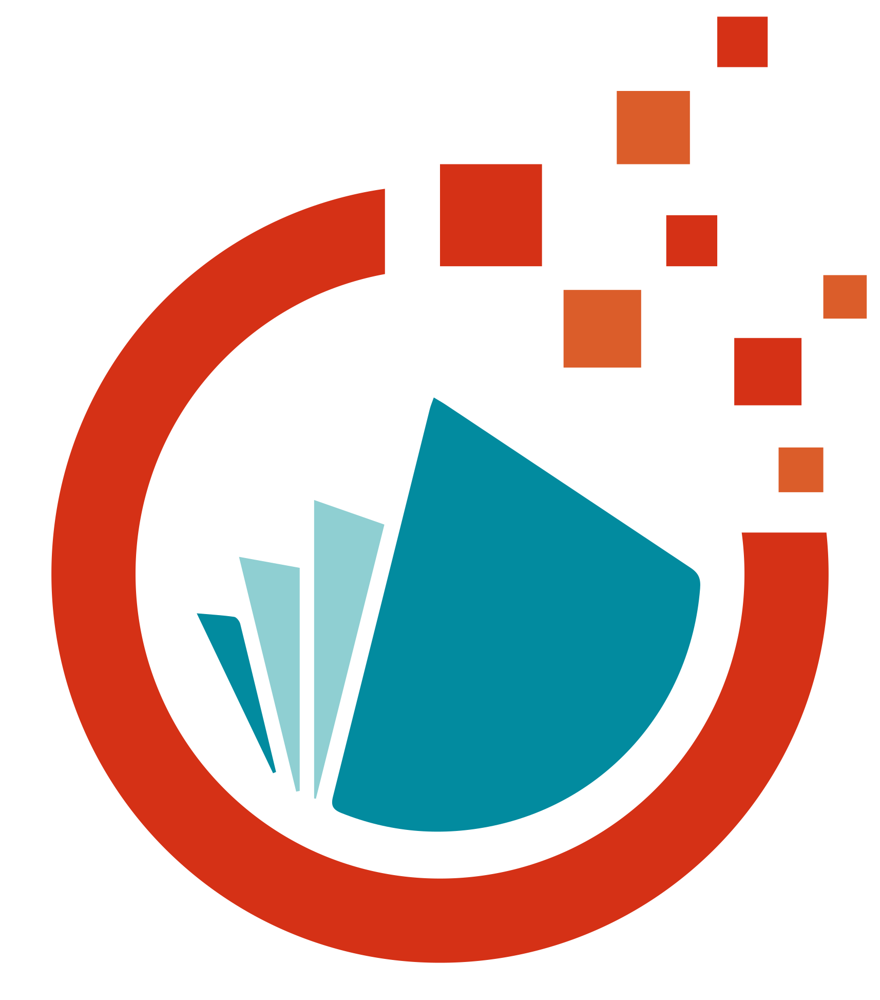
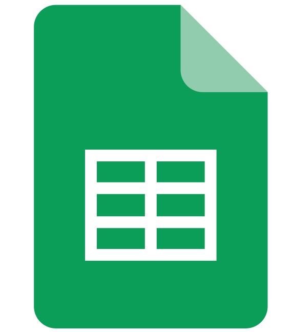
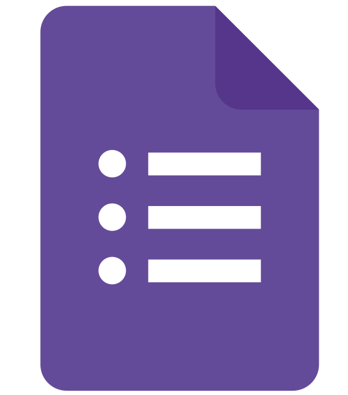
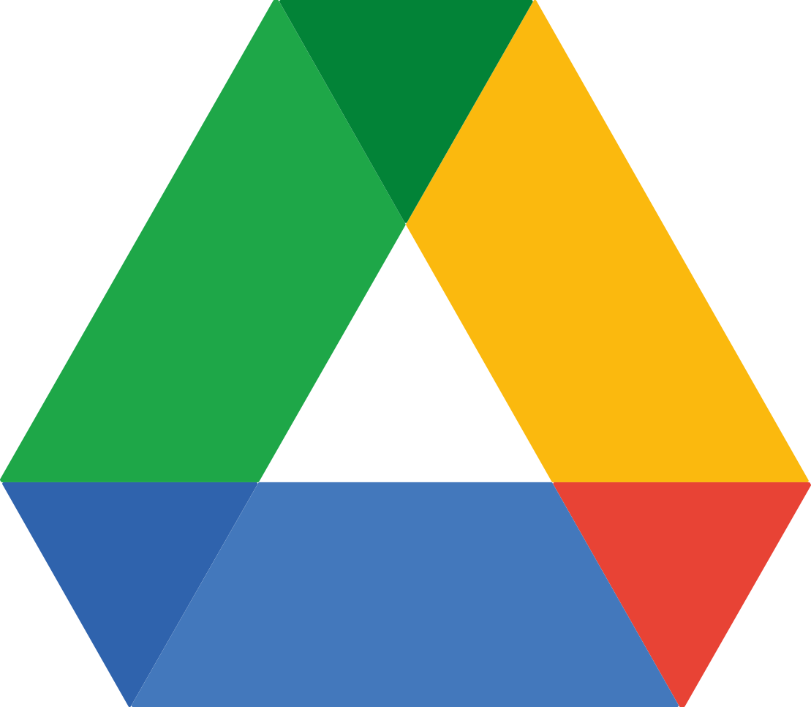

racine
├── lesupport.app
│   ├── main.js            # Processus principal d’Electron
│   ├── index.html         # Interface principale
│   ├── renderer.js        # Gestion de l'interface et des événements
│   ├── package.json       # Configuration du projet
│   ├── update.json
│   ├── version.json
│   ├── style-sheets/           
│       ├── style.css
│       ├── light-style.css
│   ├── addon/           # Dossier des scripts JS en ajouts
│       ├── unité-centrale.js
│       ├── charon.js
│   ├── utils/           # Dossier des scripts Python
│       ├── protocole Hermes/

"index.html"

<!DOCTYPE html>
<html lang="en">
<head>
    <meta charset="UTF-8">
    <meta name="viewport" content="width=device-width, initial-scale=1.0">
    <title>Lesupport - loader</title>
    <link rel="stylesheet" href="./style-sheets/style.css">
    <link rel="stylesheet" href="./style-sheets/light-style.css">
</head>
<body>

    
    

        <button class="icon" onclick="changeIframe('https://lesupport.me')"></button>
        

        <button class="icon pop-up-btn" data-popup-id="popup1">
            
        </button>
        

            <a href="https://portail.parisnanterre.fr/page-student/"><button class="icon"></button></a>
            <a href="https://coursenligne.parisnanterre.fr/"><button class="icon"></button></a>
            <a href="https://myplanning.parisnanterre.fr/direct/myplanning.jsp?ticket=ST-26389-hPV9ioXQQMN-l5mFDUZQjNeCeQM-superman"><button class="icon"></button></a>
        

        
        <button class="icon pop-up-btn" data-popup-id="popup2">
            
        </button>
        

            <a href="https://docs.google.com/document/u/0/?tgif=d"><button class="icon pop_up_icon"></button></a>
            <a href="https://docs.google.com/spreadsheets/u/0/?tgif=d"><button class="icon pop_up_icon"></button></a>
            <a href="https://docs.google.com/presentation/u/0/?tgif=d"><button class="icon pop_up_icon"></button></a>
            <a href="https://docs.google.com/forms/u/0/?tgif=d"><button class="icon pop_up_icon"></button></a>
            <a href="https://drive.google.com/drive/home"><button class="icon pop_up_icon"></button></a>
            <a href="https://mail.google.com/mail/u/0/"><button class="icon pop_up_icon"></button></a>
        

        

        <button class="icon pop-up-btn" data-popup-id="popup4">
            
        </button>
        

            <a href="https://www-dalloz-fr.faraway.parisnanterre.fr/etudiants"><button class="icon pop_up_icon"></button></a>
            <a href="https://signin.lexisnexis.com/lnaccess/app/signin?back=https://www-lexis360intelligence-fr.faraway.parisnanterre.fr/legan-callback&aci=lint"><button class="icon pop_up_icon"></button></a>
            <a href="https://www.legifrance.gouv.fr/liste/code?etatTexte=VIGUEUR&etatTexte=VIGUEUR_DIFF"><button class="icon pop_up_icon"></button></a>
        

        <button class="icon pop-up-btn" data-popup-id="popup3">
            
        </button>
        

            
A très bientôt pour de nouveaux programmes

        

        

        <button class="icon" id="schema-button">
            
        </button>
        

            
A très bientôt pour de nouveaux programmes

        

        
        
        

        

            

            <button class="icon"></button>
            <button class="icon" ></button>
            <button class="icon" ></button>
        

    

        <!-- Page des paramètres (glisse depuis la droite) -->

    

    <h1>PARAMETTRES</h1>

    <label class="section-label" for="theme">Thème :</label>
    <select class="select-theme" id="theme">
        <option class="select-option" value="light">Clair</option>
        <option class="select-option" value="dark">Sombre</option>
    </select>

         

    

    
        <label class="section-label" for="">langue</label>
        <select class="select-theme" id="">
            <option class="select-option" value="fr">fr</option>
            <option class="select-option" value="en">en</option>
        </select>
    
        
Volume sonore :

        <input type="range" class="slider">
    
        

          <button class="button">CRÉDITS</button>
          <button class="button">AIDE</button>
        

        <button class="button" id="close-settings">Fermer</button>
      

    
      

        <h1>INSTALLATION ADD ON :</h1>
        
* Une fois téléchargé, il vous faudra relancer l’application pour y appliquer les modifications liées aux téléchargements.

    
        

            

                
            
  
          <h3>LE SUPPORT WEB :</h3>
          
Version locale du support, plus besoin de connexion pour accéder aux ressources du site, à présent tout se stock sur votre machine.

          <button>a venir ...</button>
        
        

    
        

            

                
            
  
          <h3>LE SUPPORT - MODULE DÉDALE :</h3>
          
Programme léger et polyvalent de création de schémas.

          <button>a venir ...</button>
            
        

    
        

            

                
            
  
          <h3>LE SUPPORT - MODULE HERMES :</h3>
          
Partage local de fichiers lourds ou légers ? Entre appareils sur le même réseau.

          <button>a venir ...</button>
          
        

    
        

            

                
            
 
          <h3>LE SUPPORT - MODULE ATHENA :</h3>
          
Agent IA d’analyse et de résumé.

          <button>a venir ...</button>
         
        

    
        

                        

                
            
 
          <h3>LE SUPPORT - MODULE ETHOS :</h3>
          
Assistant vocal IA d’aide au travail (recherche d’articles).

          <button>a venir ...</button>
          
        

    
        

                    

                
            
 
          <h3>LE SUPPORT - MODULE CHARON :</h3>
          
Assistant chat intégré à l’application, aide au travail.

          <button>a venir ...</button>
         
        

        

                    

                
            
 
          <h3>LE SUPPORT - MODULE NOTES :</h3>
          
Assistant chat intégré à l’application, aide au travail.

          <button>a venir ...</button>
         
        

      

      

    

        <iframe id="content-frame" style="width:100%; height:100%; border:none;"></iframe>
    

    

    

        <button id="reload-notifications">Recharger les notifications</button>
<h4>CONSOLE DES NOTIFS</h4>

        
        <pre id="notif-output"></pre>
        
    

    
    

<!---->

    
</body>
</html>

--------------------------------------
"charon.js"

// Base de connaissances locale
const charonKnowledge = {
    "bonjour": "Bonjour ! Comment puis-je vous aider aujourd’hui ?",
    "aide": "Je peux vous guider sur cette page ou répondre à vos questions simples.",
    "page": "Dites-moi ce que vous cherchez sur la page, je peux vous aider à le localiser.",
    "merci": "Avec plaisir ! N'hésitez pas si vous avez d'autres questions."
};

let charonModel = null;

// Chargement du modèle IA embarqué
(async () => {
    const pipeline = window.transformers.pipeline;
    charonModel = await pipeline('text-classification', 'Xenova/distilbert-base-uncased-finetuned-sst-2-english');
    console.log('Charon est prêt');
})();

// Fonction de réponse principale
async function getCharonResponse(message) {
    // Recherche dans la base locale
    for (let key in charonKnowledge) {
        if (message.toLowerCase().includes(key.toLowerCase())) {
            return charonKnowledge[key];
        }
    }

    // Sinon, génération IA embarquée
    if (charonModel) {
        const output = await charonModel(message, {
            max_new_tokens: 40,
            temperature: 0.7,
        });
        return output[0]?.generated_text || "Je réfléchis encore...";
    }

    return "L'IA embarquée n'est pas encore prête. je vous invite a lancer la commande ''aide'' pour plus d'informations";
}

// UI Elements
const charonChat = document.getElementById("charon-chat");
const charonInput = document.getElementById("charon-input");
const charonCloseBtn = document.getElementById("charon-close");

// Envoyer message utilisateur
charonInput.addEventListener("keydown", async (e) => {
    if (e.key === "Enter" && charonInput.value.trim() !== "") {
        const userMessage = charonInput.value;
        charonChat.innerHTML += `
<strong>Vous :</strong> ${userMessage}
`;
        charonInput.value = "";

        charonChat.innerHTML += `
<em>Charon réfléchit...</em>
`;
        charonChat.scrollTop = charonChat.scrollHeight;

        const response = await getCharonResponse(userMessage);

        // Supprime "Charon réfléchit..." et ajoute la vraie réponse
        const allMessages = charonChat.querySelectorAll("div");
        const last = allMessages[allMessages.length - 1];
        if (last && last.innerText.startsWith("Charon réfléchit")) {
            last.remove();
        }

        charonChat.innerHTML += `
<strong>Charon :</strong> ${response}
`;
        charonChat.scrollTop = charonChat.scrollHeight;
    }
});

// Fermeture de l'interface Charon
charonCloseBtn.addEventListener("click", () => {
    const charonContainer = document.getElementById("charon");
    charonContainer.style.display = "none";
});
document.addEventListener("DOMContentLoaded", () => {
  const charon = document.getElementById("charon");
  const openBtn = document.getElementById("charon-btn");
  const closeBtn = document.getElementById("charon-close");

  // Affiche ou masque Charon quand on clique sur le logo
  openBtn.addEventListener("click", () => {
    charon.style.display = (charon.style.display === "none" || charon.style.display === "") ? "flex" : "none";
  });

  // Fermer Charon avec le bouton croix
  closeBtn.addEventListener("click", () => {
    charon.style.display = "none";
  });
});

// Fonction pour afficher le message d'erreur