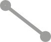
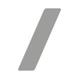

architecture du projet
📂 schemas/
├── 📄 index.html (Interface utilisateur)
├── 📄 style.css (Styles)
├── 📄 script.js (Gestion du canvas et des éléments)
└── 📂 assets/ (Images, icônes…)

index.html ///

<!DOCTYPE html>
<html lang="fr">
<head>
  <meta charset="UTF-8">
  <title>Plan de travail avec connexions</title>
  <link rel="stylesheet" href="style.css">
</head>
<body>

  

    <!-- Groupe gauche -->
    

      <button class="button btn-sm" onclick="createShape('square', event)"> </button>
      <button class="button btn-sm" onclick="createShape('circle', event)"></button>
      <button class="button btn-sm" onclick="createShape('octagon', event)"></button>
      <button class="button btn-sm" onclick="activateLinkMode()"></button>
      <button class="button btn-sm" onclick="activateLinkMode()"></button>
      <button class="button btn-lg">5</button>
    

    
.

    <!-- Groupe central -->
    

      <button onclick="loadSchema()">Charger</button>
<input type="file" id="file-input" style="display: none;" accept=".json" />

      <button class="button stretch">6</button>
      <button class="button btn-sm"></button>
      <button class="button btn-sm"></button>
      <button class="button btn-sm"></button>
      <button class="button btn-sm">10</button>
    

    
.

    <!-- Groupe icônes -->
    

      
11

      
12

      
13

    

    
.

    <!-- Groupe droite -->
    

      <button class="button btn-sm" onclick="toggleSnap()"></button>
      <button class="button btn-sm" onclick="saveSchema()">💾</button>

    

  

  

    <label>Largeur: <input id="input-width" type="number"></label>
    <label>Hauteur: <input id="input-height" type="number"></label>
    <label>Couleur bordure: <input id="input-border-color" type="color"></label>
    <label>Couleur fond: <input id="input-bg-color" type="color"></label>
    <label>Épaisseur bordure (px): <input id="input-border-width" type="number"></label>
    <label>Border Radius (%): <input id="input-border-radius" type="number"></label>
    <button onclick="applyChanges()">Appliquer</button>
    <button onclick="setAsDefault()">Définir comme modèle</button>
    <button onclick="deleteShape()">Supprimer</button>
  

  <svg id="connections" style="position:absolute; top:0; left:0; width:100%; height:100%; pointer-events:none; z-index:5;"></svg>
  

    

 
  

  
</body>
</html>

//script.js

const canvas = document.getElementById('canvas');
const editPanel = document.getElementById('edit-panel');
const snapStatus = document.getElementById('snap-status');
const linkStatus = document.getElementById('link-status');
const svg = document.getElementById('connections');

let selectedShape = null;
let snapToGrid = false;
let linkMode = false;
let linkStart = null;
const gridSize = 40;
let links = [];

window.addEventListener('resize', () => {
  updateAnchorLinks();
});

// Fonction de création de forme (square, circle, octagon)
function createShape(type, e) {
  const shape = document.createElement('div');
  shape.classList.add('shape');

  const defaults = shapeDefaults[type] || {};
  console.log('Defaults for ' + type, defaults);

  shape.style.width = defaults.width || '120px';
  shape.style.height = defaults.height || '120px';
  shape.style.backgroundColor = defaults.backgroundColor || '#cb3232';
  shape.style.borderColor = defaults.borderColor || '#fff';
  shape.style.borderWidth = defaults.borderWidth || '5px';
  shape.style.borderRadius = defaults.borderRadius || '13px';
  shape.style.position = 'absolute';
  shape.style.zIndex = '9999';

  // Placer la forme en fonction de l'événement de clic
  const shapeWidth = parseInt(shape.style.width);
  const shapeHeight = parseInt(shape.style.height);

  shape.style.left = `${e.clientX - shapeWidth / 2}px`;
  shape.style.top = `${e.clientY - shapeHeight / 2}px`;

  if (type === 'circle') {
    shape.style.borderRadius = '50%';
  } else if (type === 'octagon') {
    shape.classList.add('octagon');
  }

  shape.dataset.type = type;

  shape.addEventListener('mousedown', dragShape);
  shape.addEventListener('click', (e) => {
    e.stopPropagation();
    if (linkMode) {
      handleLink(shape);
    } else {
      selectShape(shape);
    }
  });

  addResizeHandle(shape);
  addAnchors(shape);
  canvas.appendChild(shape);

  console.log('Shape created and appended:', shape);
}

function addResizeHandle(shape) {
  const handle = document.createElement('div');
  handle.classList.add('resize-handle', 'handle-bottom-right');

  handle.addEventListener('mousedown', function (e) {
    e.stopPropagation();
    e.preventDefault();

    const startX = e.clientX;
    const startY = e.clientY;
    const startWidth = parseInt(getComputedStyle(shape).width);
    const startHeight = parseInt(getComputedStyle(shape).height);

    function onMouseMove(e) {
      const newWidth = startWidth + (e.clientX - startX);
      const newHeight = startHeight + (e.clientY - startY);

      shape.style.width = newWidth + 'px';
      shape.style.height = newHeight + 'px';
      updateAnchors(shape);
      updateConnections();
    }

    function onMouseUp() {
      document.removeEventListener('mousemove', onMouseMove);
      document.removeEventListener('mouseup', onMouseUp);
    }

    document.addEventListener('mousemove', onMouseMove);
    document.addEventListener('mouseup', onMouseUp);
  });

  shape.appendChild(handle);
}

function addAnchors(shape) {
  const positions = ['top', 'right', 'bottom', 'left', 'center'];
  positions.forEach(pos => {
    const anchor = document.createElement('div');
    anchor.classList.add('anchor-point', `anchor-${pos}`);
    shape.appendChild(anchor);
  });
  updateAnchors(shape);
}

function updateAnchors(shape) {
  const anchors = shape.querySelectorAll('.anchor-point');
  const width = parseFloat(shape.style.width);
  const height = parseFloat(shape.style.height);

  anchors.forEach(anchor => {
    let x = 0, y = 0;
    if (anchor.classList.contains('anchor-top')) {
      x = width / 2; y = 0;
    } else if (anchor.classList.contains('anchor-right')) {
      x = width; y = height / 2;
    } else if (anchor.classList.contains('anchor-bottom')) {
      x = width / 2; y = height;
    } else if (anchor.classList.contains('anchor-left')) {
      x = 0; y = height / 2;
    } else if (anchor.classList.contains('anchor-center')) {
      x = width / 2; y = height / 2;
    }
    anchor.style.left = `${x}px`;
    anchor.style.top = `${y}px`;
  });
}

function selectShape(shape) {
  selectedShape = shape;
  editPanel.style.display = 'flex';

  document.getElementById('input-width').value = parseInt(shape.style.width);
  document.getElementById('input-height').value = parseInt(shape.style.height);
  document.getElementById('input-border-color').value = rgbToHex(getComputedStyle(shape).borderColor);
  document.getElementById('input-bg-color').value = rgbToHex(getComputedStyle(shape).backgroundColor);
  document.getElementById('input-border-width').value = parseInt(getComputedStyle(shape).borderWidth);
  document.getElementById('input-border-radius').value = parseInt(getComputedStyle(shape).borderRadius);
}

function applyChanges() {
  if (!selectedShape) return;

  selectedShape.style.width = document.getElementById('input-width').value + 'px';
  selectedShape.style.height = document.getElementById('input-height').value + 'px';
  selectedShape.style.borderColor = document.getElementById('input-border-color').value;
  selectedShape.style.backgroundColor = document.getElementById('input-bg-color').value;
  selectedShape.style.borderWidth = document.getElementById('input-border-width').value + 'px';
  selectedShape.style.borderRadius = document.getElementById('input-border-radius').value + '%';
  updateAnchors(selectedShape);
  updateConnections();

  const type = selectedShape.dataset.type;
  shapeDefaults[type] = {
    width: selectedShape.style.width,
    height: selectedShape.style.height,
    backgroundColor: selectedShape.style.backgroundColor,
    borderColor: selectedShape.style.borderColor,
    borderWidth: selectedShape.style.borderWidth,
    borderRadius: selectedShape.style.borderRadius
  };

}

function toggleSnap() {
  snapToGrid = !snapToGrid;
  const icon = document.getElementById('snap-icon');
  icon.src = snapToGrid ? './assets/aimant.svg' : './assets/aimant off.svg';
}

function dragShape(e) {
  if (e.target.classList.contains('resize-handle')) return;
  e.preventDefault();
  const shape = e.target;
  let startX = e.clientX;
  let startY = e.clientY;
  let origLeft = parseInt(shape.style.left);
  let origTop = parseInt(shape.style.top);

  function onMouseMove(e) {
    let dx = e.clientX - startX;
    let dy = e.clientY - startY;
    let newLeft = origLeft + dx;
    let newTop = origTop + dy;

    if (snapToGrid) {
      newLeft = Math.round(newLeft / gridSize) * gridSize;
      newTop = Math.round(newTop / gridSize) * gridSize;
    }

    shape.style.left = newLeft + 'px';
    shape.style.top = newTop + 'px';
    updateAnchors(shape);
    updateConnections();
  }

  function onMouseUp() {
    document.removeEventListener('mousemove', onMouseMove);
    document.removeEventListener('mouseup', onMouseUp);
  }

  document.addEventListener('mousemove', onMouseMove);
  document.addEventListener('mouseup', onMouseUp);
}

function handleLink(shape) {
  if (!linkStart) {
    linkStart = shape;
  } else {
    const line = document.createElementNS("http://www.w3.org/2000/svg", "line");
    line.setAttribute('stroke', 'black');
    line.setAttribute('stroke-width', '2');
    svg.appendChild(line);
    links.push({ from: linkStart, to: shape, line });
    updateConnections();
    linkStart = null;
  }
}

function updateConnections() {
  links.forEach(link => {
    const rect1 = link.from.getBoundingClientRect();
    const rect2 = link.to.getBoundingClientRect();

    const scrollLeft = window.scrollX;
    const scrollTop = window.scrollY;

    const x1 = rect1.left + rect1.width / 2 + scrollLeft;
    const y1 = rect1.top + rect1.height / 2 + scrollTop;
    const x2 = rect2.left + rect2.width / 2 + scrollLeft;
    const y2 = rect2.top + rect2.height / 2 + scrollTop;

    link.line.setAttribute('x1', x1);
    link.line.setAttribute('y1', y1);
    link.line.setAttribute('x2', x2);
    link.line.setAttribute('y2', y2);
  });
}

canvas.addEventListener('click', () => {
  if (!linkMode) {
    selectedShape = null;
    editPanel.style.display = 'none';
  }
});

function rgbToHex(rgb) {
  const result = rgb.match(/\d+/g);
  if (!result) return '#000000';
  return "#" + result.map(x => {
    const hex = parseInt(x).toString(16);
    return hex.length == 1 ? "0" + hex : hex;
  }).join('');
}

let linkingAnchor = null;
const anchorLinks = [];

function activateLinkMode() {
  linkMode = true;
  linkingAnchor = null;
  canvas.classList.add('linking');
}

function handleAnchorClick(e) {
  e.stopPropagation();
  const anchor = e.target;

  if (!linkingAnchor) {
    linkingAnchor = anchor;
    anchor.classList.add('selected-anchor');
  } else {
    const line = document.createElementNS("http://www.w3.org/2000/svg", "line");
    line.setAttribute("stroke", "black");
    line.setAttribute("stroke-width", "2");
    svg.appendChild(line);
    anchorLinks.push({ from: linkingAnchor, to: anchor, line });

    linkingAnchor.classList.remove('selected-anchor');
    linkingAnchor = null;
    updateAnchorLinks();
  }
}

function updateAnchorLinks() {
  anchorLinks.forEach(link => {
    const rect1 = link.from.getBoundingClientRect();
    const rect2 = link.to.getBoundingClientRect();
    const scrollLeft = window.scrollX;
    const scrollTop = window.scrollY;

    const x1 = rect1.left + rect1.width / 2 + scrollLeft;
    const y1 = rect1.top + rect1.height / 2 + scrollTop;
    const x2 = rect2.left + rect2.width / 2 + scrollLeft;
    const y2 = rect2.top + rect2.height / 2 + scrollTop;

    link.line.setAttribute("x1", x1);
    link.line.setAttribute("y1", y1);
    link.line.setAttribute("x2", x2);
    link.line.setAttribute("y2", y2);
  });
}

const shapeDefaults = {
  'circle': {
    width: '120px',
    height: '120px',
    backgroundColor: '#cb3232',
    borderColor: '#fff',
    borderWidth: '3px',
    borderRadius: '50%'
  },
  'octagon': {
    width: '120px',
    height: '120px',
    backgroundColor: '#ff6633',
    borderColor: '#fff',
    borderWidth: '3px',
    borderRadius: '15%'
  },
  'square': {
    width: '120px',
    height: '120px',
    backgroundColor: '#8e44ad',
    borderColor: '#fff',
    borderWidth: '3px',
    borderRadius: '15px'
  }
};

//save

function saveSchema() {
  const shapes = Array.from(canvas.querySelectorAll('.shape')).map((shape, index) => ({
    id: shape.dataset.id || (shape.dataset.id = `shape-${index}`),
    type: shape.dataset.type,
    style: {
      width: shape.style.width,
      height: shape.style.height,
      left: shape.style.left,
      top: shape.style.top,
      backgroundColor: fixColor(shape.style.backgroundColor),
      borderColor: fixColor(shape.style.borderColor),
      borderWidth: shape.style.borderWidth,
      borderRadius: shape.style.borderRadius
    }
  }));

  const linksData = links.map(link => ({
    from: link.from.dataset.id,
    to: link.to.dataset.id
  }));

  const json = { shapes, links: linksData };
  const blob = new Blob([JSON.stringify(json, null, 2)], { type: 'application/json' });
  const url = URL.createObjectURL(blob);
  const a = document.createElement('a');
  a.href = url;
  a.download = 'schema.json';
  a.click();
  URL.revokeObjectURL(url);
}

function loadSchema() {
  document.getElementById('file-input').click();
}

document.getElementById('file-input').addEventListener('change', function(event) {
  const file = event.target.files[0];
  if (!file) return;

  const reader = new FileReader();
  reader.onload = function(e) {
    const json = JSON.parse(e.target.result);
    loadFromJSON(json);
  };
  reader.readAsText(file);
});

function fixColor(hex) {
  if (!hex) return "#000000";
  if (hex.length === 9) return hex.slice(0, 7); // enlève alpha
  if (hex.length === 4) return `#${hex[1]}${hex[1]}${hex[2]}${hex[2]}${hex[3]}${hex[3]}`; // #abc -> #aabbcc
  return hex;
}

function loadFromJSON(json) {
  // Nettoyer le canvas
  canvas.innerHTML = '

';
  svg.innerHTML = '';
  links = []; // Réinitialise les liens

  const shapeMap = {};

  const shapes = json.shapes || [];
  const linkData = json.links || [];

  shapes.forEach(data => {
    const shape = document.createElement('div');
    shape.classList.add('shape');
    Object.assign(shape.style, data.style);
    shape.dataset.type = data.type;
    shape.dataset.id = data.id || `shape-${Math.random().toString(36).substr(2, 9)}`;
    shape.style.position = 'absolute';

    shape.addEventListener('mousedown', dragShape);
    shape.addEventListener('click', (e) => {
      e.stopPropagation();
      if (linkMode) {
        handleLink(shape);
      } else {
        selectShape(shape);
      }
    });

    addResizeHandle(shape);
    addAnchors(shape);
    canvas.appendChild(shape);
    shapeMap[data.id] = shape;
  });

  linkData.forEach(link => {
    const fromShape = shapeMap[link.from];
    const toShape = shapeMap[link.to];
    if (fromShape && toShape) {
      const line = document.createElementNS("http://www.w3.org/2000/svg", "line");
      line.setAttribute('stroke', 'black');
      line.setAttribute('stroke-width', '2');
      svg.appendChild(line);
      links.push({ from: fromShape, to: toShape, line });
    }
  });

  updateConnections();
}
